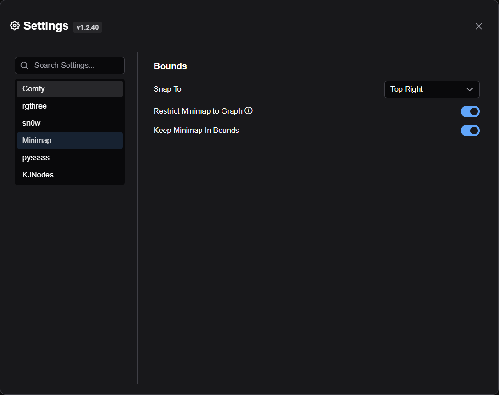

# Comfyui Minimap

A minimap of your Comfyui workflow that you can use to navigate.

## Install
Install using Comfyui manager, or create a new folder in custom_nodes and add this repository to it.

## Positioning and Resizing the Minimap

You can easily adjust the minimap's position and size to suit your workflow:

* **Move:** Hold down `Ctrl` (Windows/Linux) or `Cmd` (macOS), then click and drag the minimap to reposition it. 
* **Resize:**  Hold down `Ctrl` (Windows/Linux) or `Cmd` (macOS), then click and drag on any of the minimap's edges to resize it.
* **Change Opacity:** Hold down `Ctrl` (Windows/Linux) or `Cmd` (macOS), then scroll your mouse wheel over the minimap to adjust its opacity.

## Settings

* **Snap To:** Allows users to control where the minimap snaps on the screen.
* **Restrict Minimap to Graph:**  Ensures the minimap remains within the graph area and doesn't overlap any UI components, this also applies when dragging the minimap around.
* **Keep Minimap In Bounds:** Ensures that the minimap remains within the window boundaries.

